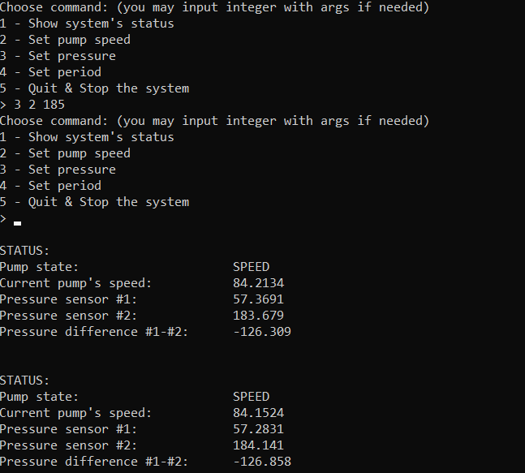

# eqipment-emulator

Программа эмулирует управление лабораторным прибором, состоящим из насоса и 2-х датчиков давления.

              

## Прибор
Лабораторный прибор состоит из насоса и двух датчиков давления - Д1, Д2.
Насос управляется командами
- Включить с заданной скоростью
- Остановить
Каждый датчик давления управляется командами
- Установить давление
- Сбросить давление в ноль

## Работа эмулятора
- Обработчик команд выполняется в отдельном потоке, в обработчике предусмотрена очередность выполнения команд.
- Подачи команд пользователем осуществляется через консоль.
- Обработчик выполняет команды с заданным периодом. Когда заканчивается очередной период, обработчик извлекает одну команду из очереди и выполняет ее, затем засыпает до окончания нового периода.
- Если в очереди нет команд, обработчик обновляет состояние прибора:

### Для насоса
- Текущий режим работы: «Остановлен» / «Скорость»
- Текущая скорость. Если насос включен, то есть находится в режиме «Скорость», текущая скорость равна заданной командой включения плюс небольшой случайный шум. Если выключен, то текущая скорость ровно 0.

### Для датчиков давления Д1, Д2
- Текущее давление каждого датчика. Давление равно заданному по команде (в том числе, если датчик был обнулен по команде) плюс небольшой случайный шум.
- Разность давления Д1 минус Д2.

- Новые команды в течение действующего периода не пробуждают поток, но кладутся в очередь.
- Синхронизация доступа к очереди.
- Возможность изменить период прямо в процессе работы. При изменении периода поток должен проснуться, не дожидаясь окончания текущего периода.

- Возможность аккуратного закрытия программы. При закрытии обработчик просыпается и завершает свой поток выполнения, не дожидаясь окончания текущего периода. Программа ожидает завершения потока и после этого закрывается.
- Возможность вывода текущего состояния прибора на экран по запросу - одним запросом всё состояние.  
